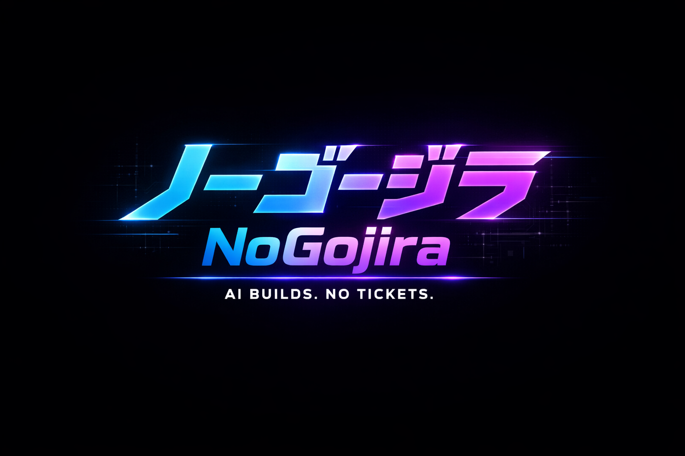

# noGojira

<p align="center">
  
</p>

<h3 align="center">ノーゴージラ (Nō-Gō-Jira)</h3>
<h4 align="center"><i>"Kill the monster. Ship the code."</i></h4>

<p align="center">
  <a href="https://github.com/fellowork/noGojira/actions/workflows/test-main.yml">
    
  </a>
  <a href="https://github.com/fellowork/noGojira/actions/workflows/test-and-merge.yml">
    
  </a>
  
  
</p>

---

**noGojira** is a lightweight, local-first project management system designed specifically for AI agent teams. It enables Product Owners and Developer Agents to collaboratively break down PRDs into Stories and Tasks, track progress, and coordinate work across multiple agents.

## 🎯 Key Features

- **Structured Collaboration**: Clear hierarchy (PRD → Stories → Tasks)
- **Agent-Native**: Designed for AI agents, exposed via MCP (Model Context Protocol)
- **Local-First**: 100% local SQLite, no external dependencies
- **Workflow Management**: States, assignments, comments
- **Zero Boilerplate**: Run directly from git with `uvx`

## 🚀 Quick Start

### Installation

Run directly from GitHub (no checkout needed):

```bash
uvx --from git+https://github.com/fellowork/noGojira nogojira
```

### MCP Configuration

Add to your MCP settings (e.g., Claude Desktop `claude_desktop_config.json`):

```json
{
  "mcpServers": {
    "noGojira": {
      "command": "uvx",
      "args": ["--from", "git+https://github.com/fellowork/noGojira", "nogojira"]
    }
  }
}
```

## 📚 Hierarchical Structure

```
Project
└── PRD (Product Requirement Document)
    └── Story (User Story / Epic)
        └── Task (Concrete work item)
            └── Comment (Discussion thread)
```

## 🤖 Use Cases

### For Product Owner Agents
- Create and manage PRDs
- Break down requirements into Stories
- Track overall project progress
- Review completed work

### For Developer Agents
- Pick up assigned Tasks
- Update Task status
- Add comments and questions
- Coordinate with other agents

### For QA Agents
- Review Tasks in "review" state
- Add test results via comments
- Mark Tasks as blocked or send back

## 🛠️ Core Entities

### PRD (Product Requirement Document)
- **Status**: `draft` → `active` → `completed` → `archived`
- Contains multiple Stories
- Created by Product Owner Agent

### Story (User Story / Epic)
- **Status**: `todo` → `in_progress` → `review` → `done` → `archived`
- Belongs to a PRD
- Can be assigned to an agent
- Contains acceptance criteria and story points

### Task (Concrete Work Item)
- **Status**: `todo` → `in_progress` → `blocked` → `review` → `done` → `archived`
- Belongs to a Story
- Must be assigned to an agent
- Can depend on other Tasks

### Comment
- Attached to PRD, Story, or Task
- Types: `comment`, `question`, `decision`, `blocker`
- Enables agent collaboration

## 📋 Example Workflow

```python
# 1. Product Owner creates project and PRD
create_project(name="E-commerce Platform")
create_prd(project_id="proj-1", title="User Authentication", ...)

# 2. Break down into Stories
create_story(prd_id="prd-1", title="Login with Email", ...)
create_story(prd_id="prd-1", title="Social Login", ...)

# 3. Create Tasks for developers
create_task(story_id="story-1", title="Design API endpoints", 
            assigned_to="backend-agent", ...)

# 4. Developer picks up work
get_agent_workload(agent_id="backend-agent", status="todo")
update_task(task_id="task-1", status="in_progress")

# 5. Add comments during work
add_comment(entity_type="task", entity_id="task-1", 
            content="Implemented JWT authentication")

# 6. Mark as ready for review
update_task(task_id="task-1", status="review")

# 7. QA reviews
add_comment(entity_type="task", entity_id="task-1", 
            comment_type="question", content="What about token refresh?")

# 8. Track progress
get_project_progress(project_id="proj-1")
get_story_progress(story_id="story-1")
```

## 🔧 Available MCP Tools (20 total)

### Project Management
- `create_project` - Create a new project container
- `list_projects` - List all projects
- `get_project` - Get project with summary statistics

### PRD Tools
- `create_prd` - Create a Product Requirement Document
- `get_prd` - Get PRD with all Stories
- `update_prd` - Update PRD fields
- `list_prds` - List PRDs with filters

### Story Tools
- `create_story` - Create a User Story
- `get_story` - Get Story with all Tasks
- `update_story` - Update Story fields
- `list_stories` - List Stories with filters

### Task Tools
- `create_task` - Create a Task
- `get_task` - Get Task with comments
- `update_task` - Update Task fields
- `list_tasks` - List Tasks with filters
- `get_agent_workload` - Get all Tasks for an agent

### Comment Tools
- `add_comment` - Add comment to PRD/Story/Task
- `get_comments` - Get all comments for entity

### Progress & Analytics
- `get_project_progress` - Overall project statistics
- `get_story_progress` - Story completion progress

## 🗄️ Data Storage

All data is stored locally in SQLite:

```
~/.local/share/nogojira/
├── nogojira.db           # SQLite database
└── attachments/          # Optional: file attachments
```

### Environment Variables (Optional)

```bash
# Custom data directory (default: ~/.local/share/nogojira)
export NOGOJIRA_DATA_DIR=/custom/path

# Custom database path (default: $DATA_DIR/nogojira.db)
export NOGOJIRA_DB_PATH=/custom/db.sqlite
```

## 🧪 Development

### Setup

```bash
# Clone repository
git clone https://github.com/fellowork/noGojira
cd noGojira

# Install with dev dependencies (using uv)
uv pip install -e ".[dev]"
```

### Running Tests

```bash
# Run all tests with coverage
pytest

# Run specific test file
pytest tests/test_models.py

# Run with verbose output
pytest -v

# Generate coverage report
pytest --cov=src --cov-report=html
```

### CI/CD with GitHub Actions

The project includes automated testing and deployment:

**🔄 Development Workflow:**
- Push to `dev` branch → Runs tests → Auto-merges to `main` if tests pass
- All changes are tested before reaching `main`

**✅ Test on Main:**
- Push to `main` or PR to `main` → Runs full test suite
- Generates coverage reports

See [`.github/SETUP.md`](.github/SETUP.md) for detailed CI/CD configuration.

### Project Structure

```
agentflow/
├── src/
│   ├── __init__.py
│   ├── models.py              # Pydantic models
│   ├── database.py            # SQLite operations
│   ├── store.py               # High-level CRUD operations
│   ├── workflows.py           # State transitions, validations
│   └── server.py              # MCP server entry point
├── tests/
│   ├── test_models.py
│   ├── test_database.py
│   ├── test_store.py
│   ├── test_workflows.py
│   └── test_server.py
├── pyproject.toml
├── README.md
└── LICENSE
```

## 🤝 Related Projects

- **[memAlpha](https://github.com/fellowork/memAlpha)** - Semantic memory system for AI agents (same architecture)

## 📄 License

MIT License - see [LICENSE](LICENSE) file for details.

## 🙏 Acknowledgments

Built with the same best practices and architecture as memAlpha, adapted for structured project management.

---

**Made with ❤️ by fellowork GmbH**

*Kill the monster. Ship the code.* 🦖⚔️

